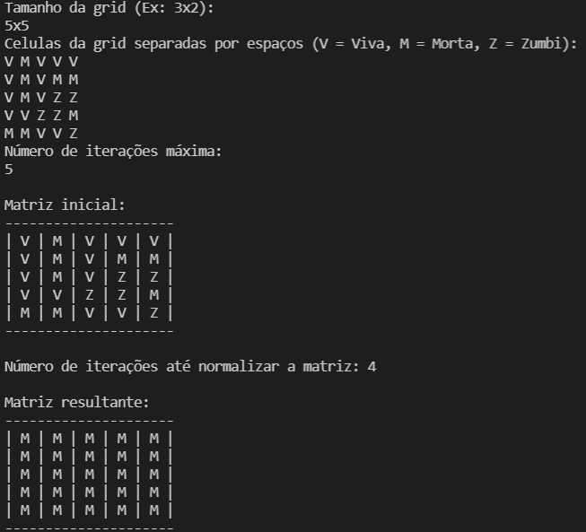

# GameOfLife

forthebadge made-with-python

<a href="https://github.com/eullerm">Euller Macena</a>

<a href="https://github.com/MalkaiOliveira">Malkai Oliveira</a>

UFF - Niteroi, 2021-2022 *<br>

Projeto desenvolvido na matéria de Linguagem de Programação. 

# Stack
<ul>
    <li> Haskell - Linguagem funcional</li>
    <li> Visual Code - Editor de texto</li>
    <li> Stack - Ferramenta de build</li>
</ul><br>

# APP
<p>
    Recebe do usuário o tamanho, a matriz inicial e o número de iterações.
    Retorna o número de iterações até a matriz normalizar e o resultado da mesma. 
</p>

<p>
    Caso alguma celula da matriz não seja passada o código inicia ela como morta.
</p><br>

## Instalação
<br>
<p>
Este app precisa do [Stack](https://docs.haskellstack.org/en/stable/README/) para funcionar 

Para Windows 
```sh
$ https://get.haskellstack.org/stable/windows-x86_64-installer.exe
```

Para Linux 
```sh
$ curl -sSL https://get.haskellstack.org/ | sh
```
</p><br>

### Testar
    $ stack build
    $ stack exec GameOfLife

# Casos de teste 
<p>
    Para o teste é possível iniciar o grid de qualquer tamanho desejado, por exemplo:
    <ul>
        <li> 5x5</li>
        <li> 16X32</li>
        <li> 100x3</li>
    </ul>
    Sendo o primeiro valor a quantidade de linhas da matriz e o segundo de colunas, esses valores devem ser sempre separados pela letra <strong>X</strong> ou <strong>x</strong>.<br>
    Para criar a matriz é necessário que cada celula esteja separada por espaço e a cada nova linha ocorra uma quebra de linha, por exemplo:<br>
    V V V<br>
    M M M<br>
    Z Z Z<br>
    Caso alguma celula não seja iniciada o programa considerará ela como morta, por exemplo em uma matriz 3x3 dado o seguinte input do usuário:<br>
    V V V<br>
    Z Z<br>
    O programa criar a matriz da seguinte forma:<br>
    V V V<br>
    Z Z M<br>
    M M M<br>
    
</p>